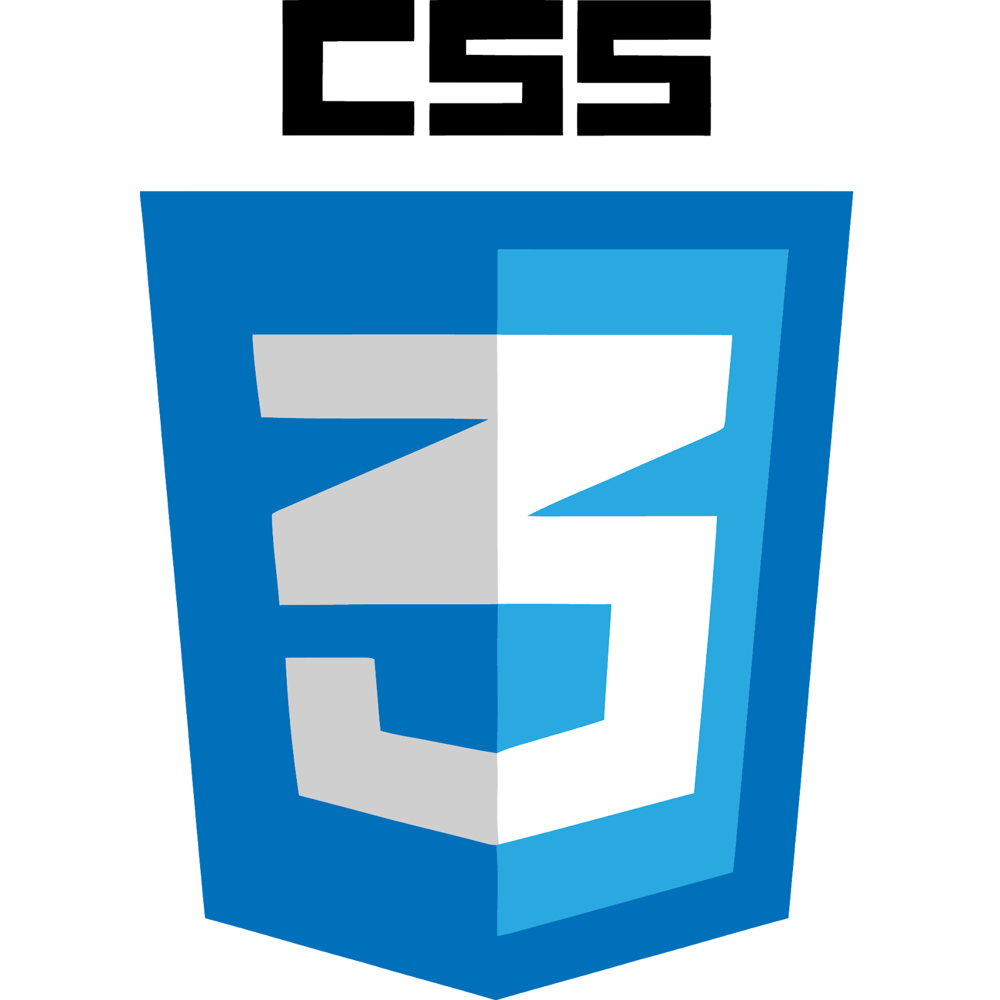
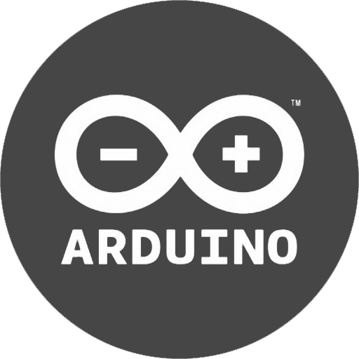

# Hey, I'm Wojciech Linowski 👋

#### about me:
* I'm 20 years old
* I live in Poland
* I am a radio amateur

#### I'm currently learning:
* frontend
* basics of pen testing
* python
* GNURadio
* software defined radio

#### languages and tools that I'm using:

  
  
  
  
  
  
  
  
  
  
  
  
  
  
  
  

  

my codepen: <a target="_blank" href="https://codepen.io/wojlin">https://codepen.io/wojlin

